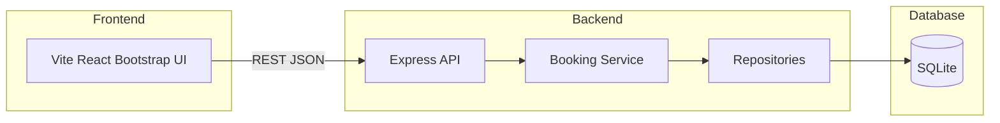

# Architecture

## Overview

Grab A Court is a monorepo demo application that models a production SDLC workflow for a country club tennis court reservation system.

## Components

### Frontend (`frontend/`)

- Vite + React + TypeScript
- Bootstrap and React Bootstrap for UI components
- Proxies `/api` requests to the backend during development
- Stores the selected demo user in `localStorage` and sends `X-Demo-User-Id` on authenticated requests

### Backend (`backend/`)

- Express + TypeScript API
- Layered structure:
  - **Routes** handle HTTP requests and responses
  - **Services** enforce booking rules and authorization
  - **Repositories** perform SQLite queries
- SQLite database file lives in `database/grab-a-court.db`
- Uses Node.js built-in `node:sqlite` (no native addon compilation required)

### Database (`database/`)

- `schema.sql` defines members, courts, and reservations
- Seed script populates eight courts, demo members, and sample reservations

## API Design

| Method | Endpoint | Description |
|--------|----------|-------------|
| GET | `/api/health` | Health check |
| GET | `/api/members/demo` | List seeded demo users |
| GET | `/api/courts/status?date=` | Court status board |
| GET | `/api/reservations?date=` | Reservations for a date |
| POST | `/api/reservations` | Create reservation |
| DELETE | `/api/reservations/:id` | Cancel reservation |
| PATCH | `/api/courts/:id/status` | Admin court status update |

## Business Rules

- Operating hours: 07:00 to 21:00
- No overlapping reservations on the same court
- Courts in `maintenance` or `unavailable` status cannot be booked
- Members can cancel their own reservations; admins can cancel any reservation
- Only admins can change court maintenance status

## Demo Authentication

This app uses demo-session behavior instead of production auth:

1. User selects a seeded member or admin in the UI
2. Frontend stores the selection locally
3. API requests include `X-Demo-User-Id`
4. Backend validates the user and enforces role-based access

This keeps the demo focused on SDLC workflow while still demonstrating authorization boundaries.
